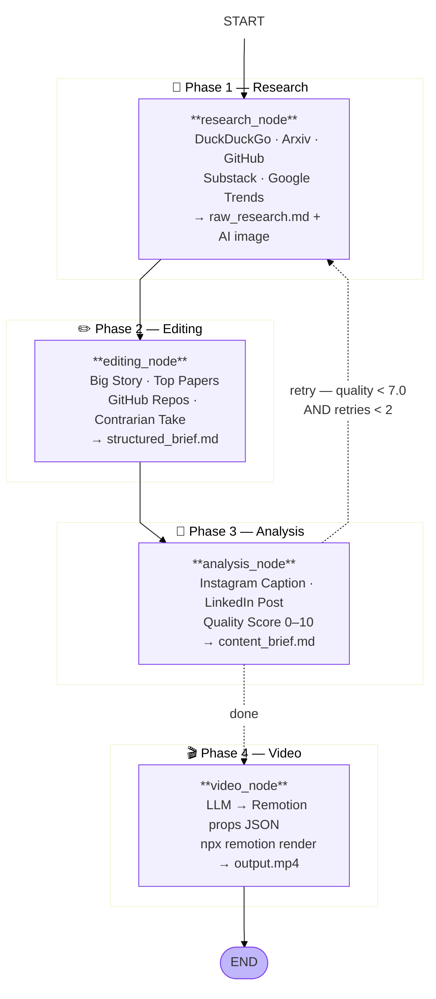

# DraftPilot — AI Content Research & Publishing Pipeline

Autonomous content pipeline for **@the.undefined.parts**. Given a topic, it researches the web, writes LinkedIn and Instagram posts, generates an AI image, renders a motion-graphics video, and publishes — all triggered from Telegram.

---

## LangGraph Pipeline



**Telegram approval keyboard** (sent after pipeline finishes):
```
[💼 LinkedIn]  [📸 Instagram]
[🚀 Post All]
[🎬 Post Reel]  [🎬 LinkedIn Video]   ← only shown when video rendered
[⏭️ Skip]
```

---

## LangGraph Nodes

### `research_node` — `agents/research_agent.py`
Scrapes 5 sources in sequence, then calls the LLM to synthesise a structured report.

| Source | What it pulls |
|---|---|
| DuckDuckGo | Top 8 web results |
| Google Trends | Related trending queries (7-day window) |
| Substack RSS | Matching newsletter articles |
| **Arxiv** | Latest academic papers sorted by submission date |
| **GitHub** | Top repos by stars matching the topic |

- Calls **Groq Llama 3.3 70B** to synthesise `raw_research.md`
- Generates AI image in parallel (3-tier fallback — see below)
- Saves `outputs/raw_research_<topic>_<date>.md`

### `editing_node` — `agents/editing_agent.py`
Structures raw research into a clean editorial brief before any post-writing happens.

Sections produced:
- **Big Story** — the single most important finding with specifics
- **Why It Matters Now** — timing and relevance hook
- **Top Papers** — from Arxiv results with one-line summaries
- **Notable GitHub Repos** — with star counts
- **Key Stats & Numbers** — only real numbers from the research
- **Practical Angle** — what a developer can do with this today
- **Contrarian Take** — the non-obvious angle
- **Suggested Hook Lines** — 3 options for the analysis agent

Saves `outputs/structured_brief_<topic>_<date>.md`

### `analysis_node` — `agents/analysis_agent.py`
- Reads from `structured_brief` (editing output) — falls back to `raw_research` if editing failed
- Calls **Groq Llama 3.3 70B** (swap to Claude Haiku via `ANALYSIS_MODEL=claude-haiku`)
- Produces Instagram Caption, LinkedIn Post, Hook, Hashtags
- Scores 0–10 across Novelty, Relevance, Clarity, Engagement
- If score < 7.0 and retries < 2 → routes back to `research_node`
- Saves `outputs/content_brief_<topic>_<date>.md`

### `video_node` — `agents/video_agent.py`
- LLM generates JSON props (topic, stat, statLabel, bullet points, accent colour)
- Renders via **Remotion** (React → headless Chrome → MP4, 1080x1080, 12s)
- Output: `outputs/videos/remotion_<topic>_<date>.mp4`

---

## State Shape

```python
class AgentState(TypedDict):
    topic: str                   # research topic
    raw_research: str            # Phase 1 output — scraped + LLM synthesis
    structured_brief: str        # Phase 2 output — editorial sections
    content_brief: str           # Phase 3 output — ready-to-post copy
    images: List[str]            # local AI-generated image paths
    image_urls: List[str]
    quality_score: float         # 0–10 from analysis node
    retry_count: int
    video_path: Optional[str]    # Remotion MP4, None if render failed
    error: Optional[str]
```

---

## Project Structure

```
content-auto/
├── agents/
│   ├── research_agent.py     # Phase 1 — scrape + LLM synthesis
│   ├── editing_agent.py      # Phase 2 — structure into editorial sections
│   ├── analysis_agent.py     # Phase 3 — write posts + quality score
│   └── video_agent.py        # Phase 4 — Remotion render
│
├── graph/
│   ├── state.py              # AgentState TypedDict
│   └── graph.py              # LangGraph StateGraph assembly + routing
│
├── tools/
│   ├── scraper.py            # DuckDuckGo · Trends · Substack · Arxiv · GitHub
│   ├── image_fetcher.py      # AI image generation (3-tier fallback)
│   ├── video_generator.py    # Remotion render via subprocess
│   ├── instagram_browser.py  # Playwright headless Chrome → Instagram
│   ├── poster.py             # LinkedIn image/video API posting
│   ├── llm.py                # LangChain model factory
│   └── progress.py           # Telegram live-progress callback
│
├── bot/
│   └── bot.py                # Telegram bot — commands + approval keyboard
│
├── video/
│   └── remotion/             # React/TypeScript Remotion project
│       └── src/
│           ├── DraftPilotVideo.tsx   # 5-scene motion graphics composition
│           └── Root.tsx
│
├── auth_instagram_cookies.py # One-time: extract Chrome cookies → ig_cookies.json
├── auth_linkedin.py          # One-time: OAuth flow → LINKEDIN_ACCESS_TOKEN in .env
├── config.py                 # Model names, quality threshold, topic list
├── main.py                   # CLI runner (no Telegram)
└── run_bot.py                # Telegram bot entry point
```

---

## Image Generation — 3-Tier Fallback

```
Tier 1 → Gemini (gemini-2.5-flash-image / Imagen 4)   [requires billing]
    ↓ fails
Tier 2 → HuggingFace FLUX.1-schnell                   [free, HF_TOKEN]
    ↓ fails
Tier 3 → Pexels stock photo                           [free, PEXELS_API_KEY]
```

The image prompt is generated by the research LLM with strict rules: must visualise the **technical concept**, not the surface-level topic word (e.g. "fashion CLIP embeddings" → neural network vector spaces, not a fashion model).

---

## Video — Remotion

5-scene MP4 at 1080×1080, 12 seconds, 30 fps:

```
0–40f    Intro     "DraftPilot / AI Content Intelligence"
40–110f  Topic     slide-up animation with topic name
110–200f Stat      pop-in callout with the key number from research
200–310f Insights  staggered bullet points sliding in from left
310–360f Outro     handle (@the.undefined.parts) + follow CTA
```

Props (topic, stat, statLabel, points[], accentColor) are generated by LLM per topic and passed via `--props` to `npx remotion render`.

---

## Publishing

### Instagram — `tools/instagram_browser.py`
- Playwright headless Chrome with saved cookies (`ig_cookies.json`)
- Account verified against `INSTAGRAM_USERNAME` before every post
- **Photo:** New post → Post → upload → Next → Next → caption → Share
- **Reel:** Same flow — Instagram auto-converts video uploads to Reels
- Cookies last ~90 days → re-run `python auth_instagram_cookies.py` to refresh

### LinkedIn — `tools/poster.py`
- **Image post:** `assets?action=registerUpload` (image recipe) → PUT binary → `ugcPosts`
- **Video post:** video recipe → PUT binary → poll until `AVAILABLE` → `ugcPosts`
- Token lasts ~60 days → re-run `python auth_linkedin.py` to refresh

---

## Setup

### 1. Install dependencies
```bash
python -m venv .venv
source .venv/bin/activate
pip install -r requirements.txt
playwright install chrome
```

### 2. Install Remotion
```bash
cd video/remotion && npm install
```

### 3. Configure `.env`
```env
# LLM
GROQ_API_KEY=...
ANTHROPIC_API_KEY=...          # optional — set ANALYSIS_MODEL=claude-haiku to use

# Images
GEMINI_API_KEY=...             # optional, requires billing
HF_TOKEN=...                   # HuggingFace free token
PEXELS_API_KEY=...

# GitHub (optional — avoids rate limiting on scraper)
GITHUB_TOKEN=...

# Instagram
INSTAGRAM_USERNAME=the.undefined.parts

# LinkedIn
LINKEDIN_ACCESS_TOKEN=...
LINKEDIN_USER_SUB=...
LINKEDIN_CLIENT_ID=...
LINKEDIN_CLIENT_SECRET=...

# Telegram
TELEGRAM_BOT_TOKEN=...

# Optional overrides
RESEARCH_MODEL=groq/llama-3.3-70b-versatile
ANALYSIS_MODEL=groq/llama-3.3-70b-versatile   # or: claude-haiku
QUALITY_THRESHOLD=7.0
MAX_RETRIES=2
```

### 4. Authenticate
```bash
# Instagram — extract Chrome cookies (re-run every ~90 days)
python auth_instagram_cookies.py

# LinkedIn — browser OAuth flow (re-run every ~60 days)
python auth_linkedin.py
```

### 5. Run
```bash
# Telegram bot
python run_bot.py

# CLI (no bot)
python main.py --topic "Attention Mechanism in LLMs"
python main.py   # random topic from config
```

---

## Switching to Claude for Better Captions

The analysis agent defaults to Groq. To upgrade to Claude Haiku:

```env
ANALYSIS_MODEL=claude-haiku
ANTHROPIC_API_KEY=sk-ant-...
```

Get API credits at **console.anthropic.com → Settings → Billing**.

---

## Key Design Decisions

| Decision | Why |
|---|---|
| LangGraph StateGraph | Clean retry loop without manual state management |
| 3-phase pipeline (research → editing → analysis) | Editing pass structures raw data before writing; improves post quality significantly |
| Arxiv + GitHub as research sources | AI/ML topics have rich paper + repo signals that web search misses |
| Playwright over instagrapi | instagrapi hits an unresolvable Bloks challenge on this account |
| Remotion over Manim | Social-media native aesthetic; no Cairo/system dependencies |
| 3-tier image fallback | Gemini free tier has quota=0; HuggingFace FLUX is free and good |
| Few-shot prompt for captions | Llama follows examples better than long instruction lists |
| Groq for research, Claude for captions | Speed vs. quality — research needs throughput, captions need creativity |
