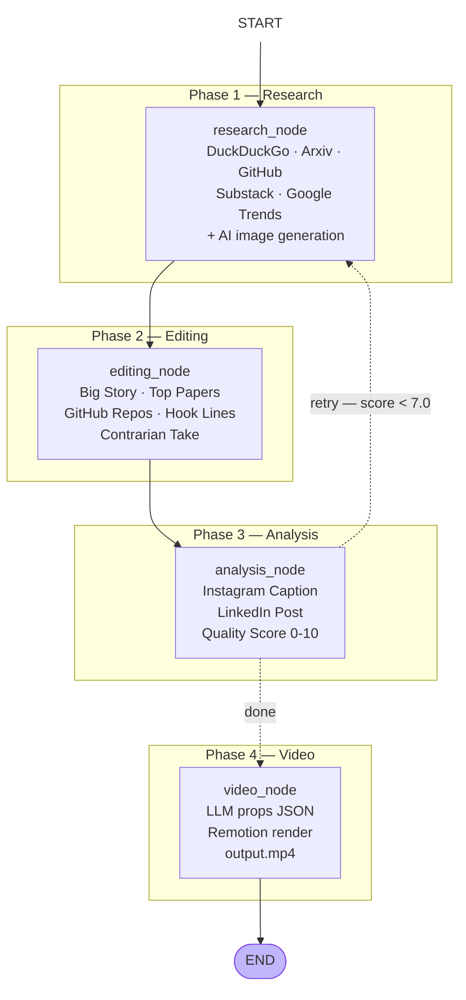

# DraftPilot — AI Content Research & Publishing System

**PRD v2.0** · Status: Active · Stack: Python · LangGraph · Remotion · Telegram

---

## 1. Goals & North Star

Build a personal AI content engine for **@the.undefined.parts**. Every run it researches a topic across multiple sources, structures the findings, writes LinkedIn and Instagram posts, generates an AI image and a motion-graphics video, and publishes — all with a single button tap from Telegram.

| Goal | Description |
|---|---|
| Research | Pull from 5 sources (web, academic papers, GitHub, newsletters, trends) per topic |
| Edit | Structure raw research into editorial sections before writing any posts |
| Publish | Post to LinkedIn and Instagram (photo + Reel) with one tap — no copy-paste |
| Video | Auto-render a 12s Remotion motion-graphics video per topic, postable as a Reel |
| Quality | LLM self-evaluates content 0–10 and retries research if below threshold |

---

## 2. System Flow



> **HITL = human-in-the-loop.** After the pipeline finishes, the Telegram bot sends a preview with inline buttons. Nothing posts until you tap a button.

---

## 3. Agent Definitions

### 3.1 Research Agent (`research_node`) — `agents/research_agent.py`

Scrapes 5 sources in parallel, synthesises into a structured research report, and generates an AI image.

| Source | What it pulls |
|---|---|
| DuckDuckGo | Top 8 web results (no API key) |
| Google Trends | Related trending queries, 7-day window |
| Substack RSS | Matching newsletter articles from configured feeds |
| **Arxiv** | Latest academic papers sorted by submission date |
| **GitHub** | Top repos by stars via GitHub Search API |

- **Model:** Groq Llama 3.3 70B (configurable via `RESEARCH_MODEL`)
- **Image generation:** 3-tier fallback — Gemini → HuggingFace FLUX.1-schnell → Pexels
- **Output:** `outputs/raw_research_<topic>_<date>.md`

### 3.2 Editing Agent (`editing_node`) — `agents/editing_agent.py`

Structures raw research into a clean editorial brief. The analysis agent reads from this instead of raw scraped text, producing noticeably better posts.

Sections produced:

| Section | Content |
|---|---|
| Big Story | The single most important finding with specifics |
| Why It Matters Now | Timing and relevance hook |
| Top Papers | From Arxiv results with one-line summaries |
| Notable GitHub Repos | With star counts |
| Key Stats & Numbers | Only real numbers from the research |
| Practical Angle | What a developer can do with this today |
| Contrarian Take | The non-obvious angle |
| Suggested Hook Lines | 3 options (stat / bold claim / question format) |

- **Model:** Groq Llama 3.3 70B (same as research, `RESEARCH_MODEL`)
- **Output:** `outputs/structured_brief_<topic>_<date>.md`

### 3.3 Analysis Agent (`analysis_node`) — `agents/analysis_agent.py`

Reads the structured brief and writes platform-specific posts. Uses few-shot prompting (a concrete Redis example) instead of prescriptive rules — Llama follows examples better than long instructions.

- **Instagram Caption:** Hook → punchy body → `↳` bullets with real data → CTA → dot spacers → 10–15 hashtags
- **LinkedIn Post:** Hook (pre-"see more") → context → insight → 3 arrow points → CTA → hashtags
- **Quality scoring:** Novelty, Relevance, Clarity, Engagement — averaged 0–10
- If score < 7.0 AND retries < 2 → routes back to `research_node`
- **Model:** Groq Llama 3.3 70B by default; switch to Claude Haiku via `ANALYSIS_MODEL=claude-haiku`
- **Output:** `outputs/content_brief_<topic>_<date>.md`

### 3.4 Video Agent (`video_node`) — `agents/video_agent.py`

Generates a 12-second motion-graphics MP4 using Remotion (React → headless Chrome).

**5-scene composition:**

| Frames | Scene | Content |
|---|---|---|
| 0–40f | Intro | "DraftPilot / AI Content Intelligence" |
| 40–110f | Topic | Slide-up animation with topic name |
| 110–200f | Stat | Pop-in callout with key number from research |
| 200–310f | Insights | Staggered bullet points from left |
| 310–360f | Outro | @the.undefined.parts + follow CTA |

- LLM generates JSON props (topic, stat, statLabel, points[], accentColor) per topic
- Rendered via `npx remotion render` subprocess
- Format: 1080×1080, 30fps, MP4
- **Output:** `outputs/videos/remotion_<topic>_<date>.mp4`

---

## 4. HITL — Telegram Bot (`bot/bot.py`)

Sends a content preview after the pipeline finishes with inline approval buttons.

```
[💼 LinkedIn]  [📸 Instagram]
[🚀 Post All]
[🎬 Post Reel]  [🎬 LinkedIn Video]   ← only shown when video rendered
[⏭️ Skip]
```

**Commands:**

| Command | Description |
|---|---|
| `/start` | Ask for a topic, then run the full pipeline |
| `/auto_start` | Auto-pick a random topic from the configured list and run |
| `/cancel` | Cancel topic input mid-conversation |

**Progress:** The bot edits a single message live as each pipeline step completes — shows which agent is running, quality score, image status, etc.

---

## 5. Publishing

### Instagram — `tools/instagram_browser.py`

Uses **Playwright headless Chrome** with saved session cookies. No Meta Business API. No instagrapi (abandoned — hits an unresolvable Bloks checkpoint on this account).

- Cookies extracted from Chrome Profile 1 once via `auth_instagram_cookies.py`
- Account verified against `INSTAGRAM_USERNAME` before every post (scans page hrefs)
- **Photo post:** New post → Post → upload → Next (crop) → Next (filters) → caption → Share
- **Reel post:** Same flow — Instagram auto-converts video uploads to Reels (dismisses info popup)
- Session lasts ~90 days → re-run `python auth_instagram_cookies.py` to refresh

### LinkedIn — `tools/poster.py`

Uses the official LinkedIn UGC Posts API with OAuth token.

- **Image post:** `assets?action=registerUpload` (image recipe) → PUT binary → `ugcPosts`
- **Video post:** video recipe → PUT binary → poll until `AVAILABLE` (max 3 min) → `ugcPosts`
- Token lasts ~60 days → re-run `python auth_linkedin.py` to refresh

---

## 6. Image Generation — 3-Tier Fallback

| Tier | Provider | Cost | Status |
|---|---|---|---|
| 1 | Gemini (`gemini-2.5-flash-image` / `imagen-4.0-fast`) | Requires billing | Optional |
| 2 | HuggingFace FLUX.1-schnell | Free with HF token | Active default |
| 3 | Pexels stock photo | Free API | Last resort |

Image prompts must visualise the **technical concept**, not the surface-level topic word. Rules enforced via the research prompt — e.g. "fashion CLIP embeddings" → neural network vector spaces, not a fashion model.

---

## 7. Tech Stack

| Layer | Choice | Notes |
|---|---|---|
| Graph framework | LangGraph `StateGraph` | Retry loop, conditional routing |
| LLM — research + editing | Groq Llama 3.3 70B | Fast, free tier |
| LLM — analysis | Groq Llama 3.3 70B (default) | Swap to Claude Haiku via env var |
| LLM — video props | Groq Llama 3.3 70B | JSON generation for Remotion |
| Model switching | LangChain `init_chat_model()` | One env var, zero code change |
| Web scraping | DuckDuckGo (`ddgs`) | No API key |
| Trends | pytrends | No API key |
| Academic papers | Arxiv API (feedparser) | No API key |
| GitHub repos | GitHub Search API | Optional `GITHUB_TOKEN` |
| Newsletters | feedparser (Substack RSS) | No API key |
| AI images | google-genai · HuggingFace · Pexels | 3-tier fallback |
| Video rendering | Remotion v4 (React/TypeScript) | Headless Chrome |
| Instagram posting | Playwright (`playwright`) | Headless Chrome + cookies |
| LinkedIn posting | `requests` (LinkedIn API v2) | UGC Posts + Assets API |
| Telegram bot | python-telegram-bot v20 | Polling, inline keyboards |
| Linting | ruff + black | Zero errors enforced |

---

## 8. LangGraph State Schema

```python
class AgentState(TypedDict):
    topic: str                   # research topic for this run
    raw_research: str            # Phase 1 output — scraped + LLM synthesis
    structured_brief: str        # Phase 2 output — editorial sections
    content_brief: str           # Phase 3 output — ready-to-post copy
    images: List[str]            # local AI-generated image paths
    image_urls: List[str]        # source URLs (for attribution)
    quality_score: float         # 0–10 from analysis node
    retry_count: int             # max 2 (MAX_RETRIES)
    video_path: Optional[str]    # Remotion MP4 path, None if render failed
    error: Optional[str]         # last error message
```

---

## 9. Project Structure

```
content-auto/
├── agents/
│   ├── research_agent.py     # Phase 1 — scrape + LLM synthesis
│   ├── editing_agent.py      # Phase 2 — structure into editorial sections
│   ├── analysis_agent.py     # Phase 3 — write posts + quality score
│   └── video_agent.py        # Phase 4 — Remotion render
│
├── graph/
│   ├── state.py              # AgentState TypedDict
│   └── graph.py              # LangGraph StateGraph + routing logic
│
├── tools/
│   ├── scraper.py            # DuckDuckGo · Trends · Substack · Arxiv · GitHub
│   ├── image_fetcher.py      # 3-tier AI image generation
│   ├── video_generator.py    # Remotion render via subprocess
│   ├── instagram_browser.py  # Playwright headless Chrome → Instagram
│   ├── poster.py             # LinkedIn image/video API posting
│   ├── llm.py                # LangChain model factory
│   └── progress.py           # Telegram live-progress callback
│
├── bot/
│   └── bot.py                # Telegram bot — commands + approval keyboard
│
├── video/
│   └── remotion/             # React/TypeScript Remotion project
│       └── src/
│           ├── DraftPilotVideo.tsx   # 5-scene motion graphics composition
│           └── Root.tsx
│
├── auth_instagram_cookies.py # One-time: extract Chrome cookies → ig_cookies.json
├── auth_linkedin.py          # One-time: OAuth flow → LINKEDIN_ACCESS_TOKEN
├── config.py                 # Models, quality threshold, topic list, Substack feeds
├── ruff.toml                 # Linter config
├── main.py                   # CLI runner (no Telegram)
└── run_bot.py                # Telegram bot entry point
```

---

## 10. Configuration & Environment

```env
# LLM
GROQ_API_KEY=...
ANTHROPIC_API_KEY=...          # optional — needed only if ANALYSIS_MODEL=claude-haiku

# Model overrides (optional)
RESEARCH_MODEL=groq/llama-3.3-70b-versatile
ANALYSIS_MODEL=groq/llama-3.3-70b-versatile   # or: claude-haiku

# Images
GEMINI_API_KEY=...             # optional, requires billing
HF_TOKEN=...                   # HuggingFace free token
PEXELS_API_KEY=...

# GitHub (optional — avoids rate limiting)
GITHUB_TOKEN=...

# Instagram
INSTAGRAM_USERNAME=the.undefined.parts

# LinkedIn
LINKEDIN_ACCESS_TOKEN=...
LINKEDIN_USER_SUB=...
LINKEDIN_CLIENT_ID=...
LINKEDIN_CLIENT_SECRET=...

# Telegram
TELEGRAM_BOT_TOKEN=...

# Quality control
QUALITY_THRESHOLD=7.0
MAX_RETRIES=2
```

---

## 11. What Was Dropped from v1.0 PRD

| v1.0 Plan | What Happened | Reason |
|---|---|---|
| X / Twitter posting | Removed entirely | No longer targeting X |
| instagrapi | Replaced with Playwright | Unresolvable Bloks checkpoint on this account |
| Nitter RSS | Removed | X no longer a target; Nitter unreliable |
| Pexels-only images | Replaced with 3-tier AI generation | AI images are more on-brand and unique |
| FastAPI web dashboard | Not built | Telegram bot covers all HITL needs |
| GitHub Actions cron | Not deployed | Running locally; cron is future work |
| SQLite run log | Not built | Filesystem outputs are sufficient for now |
| Manim animations | Removed | Remotion wins for social-media aesthetic |
| Edit flow in Telegram | Not built | Skip → re-run is sufficient |

---

## 12. Risks & Mitigations

| Risk | Mitigation |
|---|---|
| Instagram session expires (~90 days) | Re-run `auth_instagram_cookies.py` — documented in README |
| LinkedIn token expires (~60 days) | Re-run `auth_linkedin.py` — documented in README |
| Groq rate limits | Retry logic in LangGraph; fallback model via env var |
| HuggingFace FLUX quota | Pexels fallback always available |
| Remotion render fails | `video_path` stays `None`; pipeline continues; video buttons hidden in bot |
| GitHub API rate limit (60 req/hr unauthenticated) | Optional `GITHUB_TOKEN` raises limit to 5,000/hr |
| Low quality research | Retry loop (max 2) + editing node structures raw data before analysis |
| Wrong Instagram account posted | Account verification step scans page hrefs before every post |

---

## 13. Success Metrics

| Metric | Target |
|---|---|
| Full pipeline time (research → video) | < 5 minutes end-to-end |
| Quality score | Avg > 7.5 / 10 across runs |
| Caption format compliance | Hook + bullets + CTA + hashtags on every run |
| Instagram Reel upload success rate | > 90% (Playwright flow stable) |
| LinkedIn post success rate | > 95% (official API, reliable) |

---

## 14. Future Work

- **Google Drive input** — read a content ideas file to auto-pick topics
- **Gmail reader** — pull feedback/requests as topic triggers
- **Claude Haiku analysis** — upgrade once Anthropic API credits added (console.anthropic.com)
- **Scheduled auto-runs** — cron via GitHub Actions or local launchd
- **Post performance tracking** — LinkedIn API impressions + Instagram insights → feed back into topic selection
- **Carousel generation** — auto-generate Instagram carousel from the structured brief sections
- **Voiceover layer** — add TTS audio to the Remotion video for short-form content
